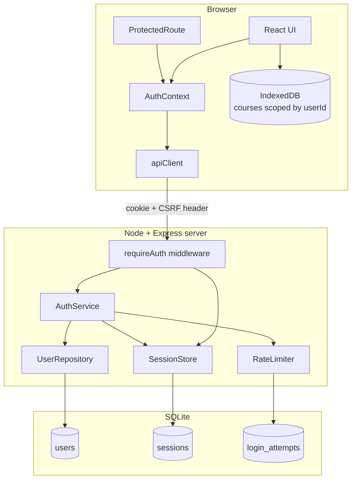
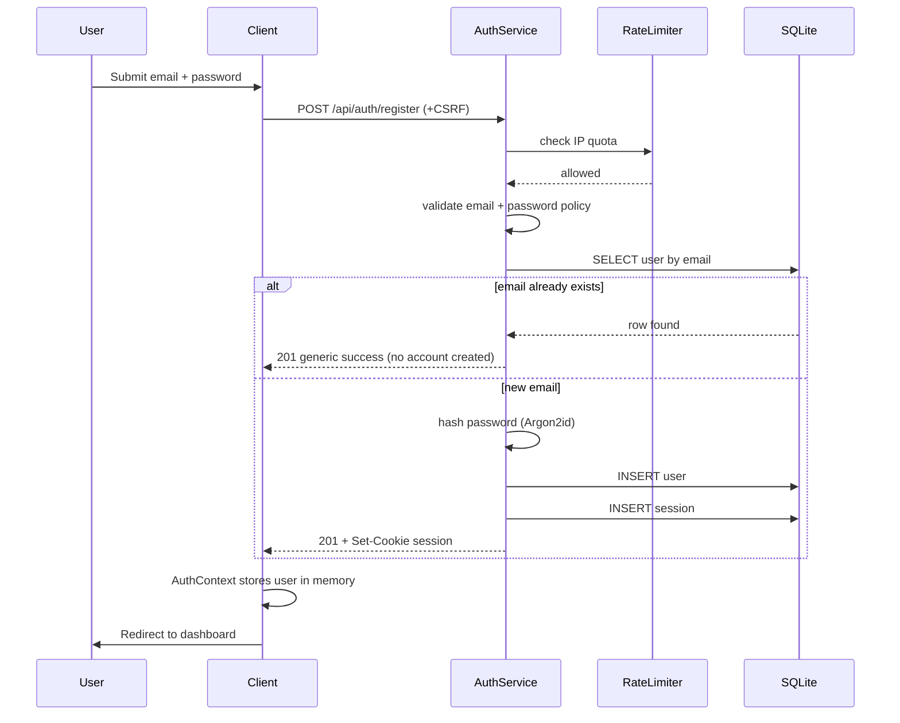
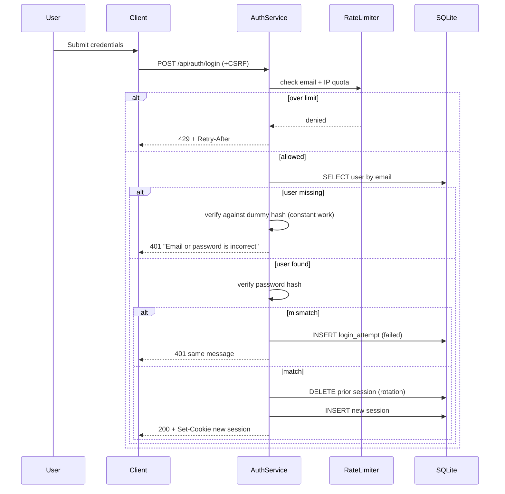
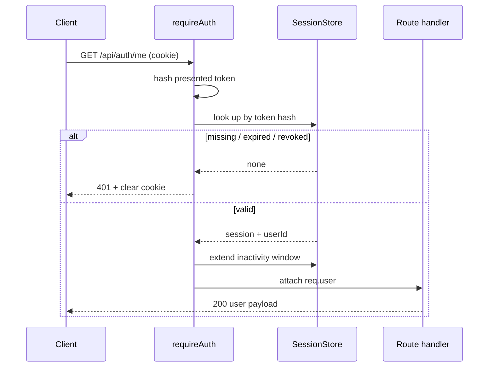

# Design Document: User Accounts and Dashboard

## Overview

This feature introduces a real backend to Clip2Course. Until now the app has been entirely client-side; authentication cannot be done credibly in that model, so we add a small Express + TypeScript server that owns password hashing, session issuance and authorization decisions.

The guiding principle is that **the server is the only authority**. The client never sends a user id to identify itself, never decides whether a resource is visible, and never holds a credential it could leak. Client-side route guards exist purely for navigation comfort; every protected read is independently enforced server-side.

Course content stays in IndexedDB and becomes scoped per user. That keeps the existing generation pipeline untouched and avoids a server-side course schema, at the cost of courses not following a user between devices — an explicit non-goal for this feature.

## Architecture



### Deployment shape

| Environment | Client | API | Notes |
|---|---|---|---|
| Development | Vite dev server :5173 | Express :3001 | Vite proxies `/api/auth/*` to the server |
| Production | Static build served by Express | Same Express process | Same origin, so `SameSite=Lax` cookies work without exception |

Serving both from one origin in production is a deliberate choice: it avoids third-party cookie problems and removes the need for permissive CORS.

## Sequence Diagrams

### Flow 1: Registration



Requirement 1.4 makes both branches indistinguishable from outside. The response shape, status code and latency are the same whether or not the address was already taken.

### Flow 2: Login with session rotation



### Flow 3: Authenticated request



## Components and Interfaces

### Component 1: UserRepository (server)

**Purpose**: Owns all reads and writes of user rows, so no route handler writes SQL directly and swapping SQLite for Postgres touches one file.

```typescript
interface UserRecord {
  id: string            // uuid
  email: string         // stored lowercased + trimmed
  passwordHash: string
  displayName: string
  createdAt: Date
}

interface UserRepository {
  findByEmail(email: string): Promise<UserRecord | null>
  findById(id: string): Promise<UserRecord | null>
  create(input: {
    email: string
    passwordHash: string
    displayName: string
  }): Promise<UserRecord>
}
```

### Component 2: SessionStore (server)

**Purpose**: Issues, verifies, extends and revokes sessions. Sessions are opaque random tokens, and only their SHA-256 hash is persisted — a leaked database therefore does not hand an attacker usable sessions.

```typescript
interface SessionRecord {
  id: string             // uuid, not the token
  userId: string
  tokenHash: string      // sha256 of the raw token
  createdAt: Date
  absoluteExpiresAt: Date  // createdAt + 30 days
  idleExpiresAt: Date      // last seen + 7 days
}

interface SessionStore {
  /** Returns the raw token, which is never stored. */
  issue(userId: string): Promise<{ token: string; record: SessionRecord }>
  verify(token: string): Promise<SessionRecord | null>
  touch(sessionId: string): Promise<void>
  revoke(token: string): Promise<void>
  revokeAllForUser(userId: string): Promise<void>
  deleteExpired(): Promise<number>
}
```

### Component 3: AuthService (server)

**Purpose**: Applies the policy in Requirements 1–4: validation, hashing, uniform responses, rate limiting.

```typescript
interface RegisterInput { email: string; password: string; displayName?: string }
interface LoginInput { email: string; password: string }
interface PublicUser { id: string; email: string; displayName: string }

interface AuthResult {
  user: PublicUser | null   // null on the "email already taken" path
  token: string | null
}

interface AuthService {
  register(input: RegisterInput, clientIp: string): Promise<AuthResult>
  login(input: LoginInput, clientIp: string): Promise<AuthResult>
  logout(token: string | undefined): Promise<void>
  currentUser(token: string | undefined): Promise<PublicUser | null>
}
```

### Component 4: RateLimiter (server)

**Purpose**: Fixed-window counters for Requirement 4, backed by the `login_attempts` table so limits survive a restart.

```typescript
interface RateLimitResult {
  allowed: boolean
  retryAfterSeconds: number  // 0 when allowed
}

interface RateLimiter {
  checkLogin(email: string, ip: string): Promise<RateLimitResult>
  checkRegistration(ip: string): Promise<RateLimitResult>
  recordFailure(email: string, ip: string): Promise<void>
  clearFor(email: string): Promise<void>   // called on success
}
```

### Component 5: AuthContext (client)

**Purpose**: Single source of truth for who is signed in, exposed via a `useAuth()` hook.

```typescript
type AuthStatus = 'checking' | 'authenticated' | 'anonymous'

interface AuthContextValue {
  status: AuthStatus
  user: PublicUser | null
  login(email: string, password: string): Promise<void>
  register(email: string, password: string, displayName?: string): Promise<void>
  logout(): Promise<void>
}
```

The `'checking'` state exists to satisfy Requirement 6.7: without it, a signed-in user reloading the page sees the login screen flash before the session check returns.

### Component 6: apiClient (client)

**Purpose**: One wrapper for every server call, so credentials, CSRF and 401 handling are not reimplemented per call site.

```typescript
interface ApiError extends Error {
  status: number
  fieldErrors?: Record<string, string>
  retryAfterSeconds?: number
  isNetworkError: boolean
}

interface ApiClient {
  get<T>(path: string): Promise<T>
  post<T>(path: string, body?: unknown): Promise<T>
}
```

Behaviour:
- always sends `credentials: 'include'`
- attaches `X-CSRF-Token` from the readable CSRF cookie on state-changing calls
- distinguishes a network failure from a 401 (Requirement 10.2), so a dropped connection does not sign the user out

## Data Models

### Model 1: users

```sql
CREATE TABLE users (
  id            TEXT PRIMARY KEY,
  email         TEXT NOT NULL,
  password_hash TEXT NOT NULL,
  display_name  TEXT NOT NULL,
  created_at    TEXT NOT NULL
);

-- Case-insensitive uniqueness (Requirement 1.6)
CREATE UNIQUE INDEX idx_users_email ON users (LOWER(email));
```

**Validation Rules**
- `email`: valid syntax, ≤254 characters, stored lowercased and trimmed
- `password_hash`: Argon2id encoded string; plaintext never persisted
- `display_name`: defaults to the local part of the email when not supplied

### Model 2: sessions

```sql
CREATE TABLE sessions (
  id                  TEXT PRIMARY KEY,
  user_id             TEXT NOT NULL REFERENCES users(id) ON DELETE CASCADE,
  token_hash          TEXT NOT NULL UNIQUE,
  created_at          TEXT NOT NULL,
  absolute_expires_at TEXT NOT NULL,
  idle_expires_at     TEXT NOT NULL
);

CREATE INDEX idx_sessions_token ON sessions (token_hash);
CREATE INDEX idx_sessions_user ON sessions (user_id);
```

**Validation Rules**
- `token_hash` is SHA-256 of a 32-byte random token; the token itself is never stored
- A session is valid only while `now < absolute_expires_at AND now < idle_expires_at`
- `ON DELETE CASCADE` guarantees deleting a user cannot leave usable sessions

### Model 3: login_attempts

```sql
CREATE TABLE login_attempts (
  id           INTEGER PRIMARY KEY AUTOINCREMENT,
  email        TEXT,
  ip           TEXT NOT NULL,
  kind         TEXT NOT NULL,   -- 'login' | 'register'
  succeeded    INTEGER NOT NULL,
  attempted_at TEXT NOT NULL
);

CREATE INDEX idx_attempts_email_time ON login_attempts (email, attempted_at);
CREATE INDEX idx_attempts_ip_time ON login_attempts (ip, attempted_at);
```

**Validation Rules**
- The submitted password is never written to this table (Requirement 4.4)
- Rows older than the longest window (1 hour) are pruned by the cleanup job

### Model 4: IndexedDB schema version 2 (client)

```typescript
interface Clip2CourseDBv2 extends DBSchema {
  courses: {
    key: string
    value: CourseData & { userId: string | null }  // null = pre-auth record
    indexes: { createdAt: Date; userId: string }
  }
  progress: {
    key: string
    value: CourseProgress & { userId: string | null }
    indexes: { userId: string }
  }
}
```

**Validation Rules**
- `userId === null` marks a record created before this feature; it is claimable exactly once (Requirement 8.5)
- Reads always filter by the signed-in user's id
- The version 1 → 2 upgrade only *adds* a field and indexes; it never deletes or rewrites course content (Requirement 8.7)

## Algorithmic Pseudocode

### Registration

```typescript
async function register(
  input: RegisterInput,
  clientIp: string
): Promise<AuthResult> {
  // Requirement 4.3
  const quota = await rateLimiter.checkRegistration(clientIp)
  if (!quota.allowed) {
    throw new RateLimitError(quota.retryAfterSeconds)
  }

  // Requirement 1.5, 1.8
  const email = normalizeEmail(input.email)
  const fieldErrors = validateRegistration(email, input.password)
  if (Object.keys(fieldErrors).length > 0) {
    throw new ValidationError(fieldErrors)
  }

  const existing = await users.findByEmail(email)

  if (existing) {
    // Requirement 1.4: do the same work, return the same shape.
    // Hashing anyway keeps the timing profile identical.
    await hashPassword(input.password)
    return { user: null, token: null }
  }

  // Requirement 1.7
  const passwordHash = await hashPassword(input.password)

  const user = await users.create({
    email,
    passwordHash,
    displayName: input.displayName?.trim() || email.split('@')[0],
  })

  const { token } = await sessions.issue(user.id)

  return { user: toPublicUser(user), token }
}
```

**Preconditions**
- `clientIp` is derived server-side, never from a client-supplied header alone
- The database is reachable

**Postconditions**
- At most one user row exists for the email, case-insensitively
- The returned token, when present, identifies exactly one fresh session
- No plaintext password is stored, logged or returned
- Callers cannot distinguish "created" from "already existed"

### Login

```typescript
async function login(
  input: LoginInput,
  clientIp: string
): Promise<AuthResult> {
  const email = normalizeEmail(input.email)

  // Requirement 4.1, 4.2
  const quota = await rateLimiter.checkLogin(email, clientIp)
  if (!quota.allowed) {
    throw new RateLimitError(quota.retryAfterSeconds)
  }

  const user = await users.findByEmail(email)

  // Requirement 2.3: equalise work for unknown accounts so timing
  // does not disclose whether the email is registered.
  const hashToCompare = user?.passwordHash ?? DUMMY_ARGON2_HASH
  const passwordMatches = await verifyPassword(hashToCompare, input.password)

  if (!user || !passwordMatches) {
    await rateLimiter.recordFailure(email, clientIp)
    throw new AuthError('Email or password is incorrect')  // Requirement 2.2
  }

  // Requirement 2.7: rotate, so a pre-login token cannot be replayed
  await sessions.revokeAllForUser(user.id)
  const { token } = await sessions.issue(user.id)

  await rateLimiter.clearFor(email)

  return { user: toPublicUser(user), token }
}
```

**Preconditions**
- `DUMMY_ARGON2_HASH` was produced with the same parameters as real hashes

**Postconditions**
- On success exactly one session exists for the user, and it is newly created
- On failure no session is created and the failure is counted
- The error message is byte-identical for unknown-email and wrong-password

**Loop Invariants**: N/A (no iteration)

### Session verification middleware

```typescript
async function requireAuth(req, res, next) {
  const token = req.cookies[SESSION_COOKIE]

  const session = token ? await sessions.verify(token) : null

  if (!session) {
    // Requirement 2.6, 5.2
    clearSessionCookie(res)
    return res.status(401).json({ error: 'Not authenticated' })
  }

  // Requirement 2.5: sliding idle window, fixed absolute expiry
  await sessions.touch(session.id)

  req.user = await users.findById(session.userId)
  if (!req.user) {
    // User deleted while the session lived
    await sessions.revoke(token)
    clearSessionCookie(res)
    return res.status(401).json({ error: 'Not authenticated' })
  }

  next()
}
```

**Preconditions**: cookie parsing has run

**Postconditions**
- `req.user` is set only for a live session belonging to an existing user
- Expired, revoked and unknown tokens are indistinguishable to the caller
- The absolute expiry is never extended

### Session verification

```typescript
async function verify(token: string): Promise<SessionRecord | null> {
  const tokenHash = sha256(token)
  const row = await db.get(
    `SELECT * FROM sessions WHERE token_hash = ?`,
    tokenHash
  )

  if (!row) return null

  const now = new Date()
  if (now >= row.absoluteExpiresAt || now >= row.idleExpiresAt) {
    // Expired sessions are removed on sight rather than left to accumulate
    await db.run(`DELETE FROM sessions WHERE id = ?`, row.id)
    return null
  }

  return row
}
```

**Postconditions**
- Returns a session only while both expiry conditions hold
- Never returns a session for a revoked token, because revocation deletes the row

### Claiming pre-auth course data

```typescript
async function claimUnownedData(userId: string): Promise<number> {
  const db = await getDB()
  // One transaction: either every record is claimed or none is
  const tx = db.transaction(['courses', 'progress'], 'readwrite')

  let claimed = 0

  for (const storeName of ['courses', 'progress'] as const) {
    const store = tx.objectStore(storeName)
    let cursor = await store.openCursor()

    while (cursor) {
      // Requirement 8.5: only records with no owner are adoptable
      if (cursor.value.userId === null || cursor.value.userId === undefined) {
        await cursor.update({ ...cursor.value, userId })
        claimed++
      }
      cursor = await cursor.continue()
    }
  }

  await tx.done
  return claimed
}
```

**Preconditions**
- The version 2 upgrade has completed
- `userId` belongs to the currently signed-in user

**Postconditions**
- No record already owned by another user is modified
- Course content itself is untouched; only the `userId` field changes
- On transaction failure nothing is claimed (Requirement 8.7)

**Loop Invariants**
- Every record visited so far either had an owner, or now belongs to `userId`
- The set of course ids is unchanged throughout

### Dashboard statistics

```typescript
function computeDashboardStats(
  courses: CourseSummary[],
  progress: CourseProgress[]
): DashboardStats {
  // Requirement 7.6: an empty library yields zeros, never NaN
  if (courses.length === 0) {
    return {
      totalCourses: 0,
      completedCourses: 0,
      questionsAnswered: 0,
      averageScore: 0,
      continueCourse: null,
    }
  }

  const progressById = new Map(progress.map(p => [p.courseId, p]))

  let completedCourses = 0
  let questionsAnswered = 0
  let scoreSum = 0

  for (const course of courses) {
    const p = progressById.get(course.id)
    if (!p) continue

    if (p.completedSections.length >= course.totalSections) {
      completedCourses++
    }

    const scores = Object.values(p.quizScores)
    questionsAnswered += scores.length
    scoreSum += scores.reduce((a, b) => a + b, 0)
  }

  const incomplete = courses
    .filter(c => {
      const p = progressById.get(c.id)
      return !p || p.completedSections.length < c.totalSections
    })
    .sort((a, b) => +new Date(b.lastAccessedAt) - +new Date(a.lastAccessedAt))

  return {
    totalCourses: courses.length,
    completedCourses,
    questionsAnswered,
    // Guarded division — the empty case is handled above, this protects
    // the case where courses exist but no question has been answered
    averageScore: questionsAnswered === 0
      ? 0
      : Math.round((scoreSum / questionsAnswered) * 100) / 100,
    continueCourse: incomplete[0] ?? null,
  }
}
```

**Preconditions**
- `courses` and `progress` already contain only the signed-in user's records

**Postconditions**
- Every returned number is finite and ≥ 0
- `completedCourses <= totalCourses`
- `continueCourse` is null exactly when no incomplete course exists

**Loop Invariants**
- Running totals only ever increase
- `completedCourses` never exceeds the number of courses visited

## Key Functions with Formal Specifications

### Function: normalizeEmail()

```typescript
function normalizeEmail(raw: string): string {
  return raw.trim().toLowerCase()
}
```

**Preconditions**: `raw` is a string

**Postconditions**
- Output contains no leading or trailing whitespace and no uppercase characters
- Idempotent: `normalizeEmail(normalizeEmail(x)) === normalizeEmail(x)`
- Two addresses differing only in case or surrounding whitespace map to the same output

### Function: validateRegistration()

```typescript
const MIN_PASSWORD_LENGTH = 12

function validateRegistration(
  email: string,
  password: string
): Record<string, string> {
  const errors: Record<string, string> = {}

  if (!email) {
    errors.email = 'Email is required'
  } else if (email.length > 254 || !EMAIL_PATTERN.test(email)) {
    errors.email = 'Enter a valid email address'
  }

  if (!password) {
    errors.password = 'Password is required'
  } else if (password.length < MIN_PASSWORD_LENGTH) {
    errors.password = `Use at least ${MIN_PASSWORD_LENGTH} characters`
  } else if (COMMON_PASSWORDS.has(password.toLowerCase())) {
    errors.password = 'This password is too common — choose another'
  }

  return errors
}
```

**Preconditions**: `email` has been normalized

**Postconditions**
- Returns an empty object if and only if every rule passes
- Each message names the rule that failed (Requirement 1.3, 10.4)
- No side effects; the password is not logged

### Function: buildSessionCookie()

```typescript
function buildSessionCookie(token: string, isHttps: boolean): CookieOptions {
  return {
    httpOnly: true,        // unreachable from JavaScript
    sameSite: 'lax',       // blocks cross-site form posts
    secure: isHttps,       // Requirement 5.5
    path: '/',
    maxAge: ABSOLUTE_TTL_MS,
  }
}
```

**Postconditions**
- `httpOnly` is always true, so XSS cannot read the session
- `secure` is true whenever the request arrived over HTTPS

## Example Usage

```typescript
// Example 1: wiring the provider
function Root() {
  return (
    <BrowserRouter>
      <AuthProvider>
        <App />
      </AuthProvider>
    </BrowserRouter>
  )
}

// Example 2: protecting routes
<Routes>
  <Route path="/" element={<LandingPage />} />
  <Route path="/login" element={<LoginPage />} />
  <Route path="/register" element={<RegisterPage />} />

  <Route element={<ProtectedRoute />}>
    <Route path="/app/dashboard" element={<UserDashboard />} />
    <Route path="/app/create" element={<CreateCourse />} />
    <Route path="/app/courses" element={<Dashboard />} />
    <Route path="/app/course/:id" element={<CourseViewer />} />
  </Route>

  <Route path="*" element={<NotFound />} />
</Routes>

// Example 3: the guard itself
function ProtectedRoute() {
  const { status } = useAuth()
  const location = useLocation()

  // Requirement 6.7 — no login flash for a signed-in user
  if (status === 'checking') return <FullPageSpinner />

  if (status === 'anonymous') {
    return <Navigate to="/login" state={{ from: location.pathname }} replace />
  }

  return <Outlet />
}

// Example 4: login form submit
async function handleSubmit(event: FormEvent) {
  event.preventDefault()
  setSubmitting(true)          // Requirement 9.6
  setError(null)

  try {
    await login(email, password)
    navigate(location.state?.from ?? '/app/dashboard', { replace: true })
  } catch (err) {
    const e = err as ApiError
    if (e.isNetworkError) {
      setError("Can't reach the server. Check your connection and try again.")
    } else if (e.status === 429) {
      setError(`Too many attempts. Try again in ${e.retryAfterSeconds}s.`)
    } else {
      setError(e.message)      // rendered as plain text, Requirement 9.4
    }
  } finally {
    setSubmitting(false)
  }
}

// Example 5: reading courses for the signed-in user
const courses = await listCourses(user.id)   // never returns another user's rows
```

## API Surface

| Method | Path | Auth | Purpose |
|---|---|---|---|
| POST | `/api/auth/register` | none | Create account, issue session |
| POST | `/api/auth/login` | none | Verify credentials, issue session |
| POST | `/api/auth/logout` | optional | Revoke session, clear cookie |
| GET | `/api/auth/me` | required | Current user for session restore |
| GET | `/api/auth/csrf` | none | Issue the readable CSRF cookie |

Error response shape is uniform:

```json
{ "error": "Human readable message", "fieldErrors": { "password": "..." } }
```

## Security Design Notes

**Why not a JWT in localStorage.** A JWT there is readable by any injected script and cannot be revoked before expiry. An opaque token in an `httpOnly` cookie is unreadable from JavaScript, and because the server holds the session row, logout is immediate and total.

**Why store only the token hash.** Reading the `sessions` table gives an attacker hashes, not tokens. Without the preimage they cannot forge a cookie, which turns a database disclosure into a much smaller incident.

**CSRF.** Cookie auth means the browser attaches credentials to cross-site requests automatically. `SameSite=Lax` blocks the common cases; the double-submit CSRF token (readable cookie echoed in `X-CSRF-Token`) covers the rest, since a cross-origin page cannot read our cookie to copy the value.

**Uniform responses.** Requirements 1.4 and 2.2 cost some UX friendliness and buy resistance to account enumeration. Timing is equalised too (Requirement 2.3), because a fast "no such user" reply leaks exactly what the identical message was hiding.

**Argon2id parameters.** Targeting ≥100ms (Requirement 4.5) with OWASP-suggested memory-hard settings. Parameters live in one config module so they can be raised as hardware improves, and the encoded hash records the parameters used, so existing hashes keep verifying.

**Client guards are not security.** `ProtectedRoute` is navigation only. Anyone can edit client state to render a protected page; they still cannot obtain another user's data, because Requirement 5 enforcement lives on the server.

## Correctness Properties

*A property is a characteristic or behavior that should hold true across all valid executions of a system — a formal statement about what the system should do, verifiable by property-based testing.*

### Property 1: Passwords Are Never Recoverable

*For any* registration input, after `register` completes, the stored user record SHALL NOT contain the plaintext password as any field value or substring, and the stored hash SHALL NOT equal the plaintext.

**Validates: Requirements 1.7, 9.2, 9.3**

### Property 2: Email Normalization Is Idempotent and Collapsing

*For any* string `s`, `normalizeEmail(normalizeEmail(s)) === normalizeEmail(s)`, and for any string `t` differing from `s` only by surrounding whitespace or letter case, `normalizeEmail(s) === normalizeEmail(t)`.

**Validates: Requirements 1.5, 1.6**

### Property 3: Registration Responses Are Indistinguishable

*For any* password satisfying the policy, the response status and body shape of registering a fresh email SHALL equal those of registering an already-registered email.

**Validates: Requirements 1.4**

### Property 4: Login Failure Messages Are Uniform

*For any* pair of failing login attempts — one with an unregistered email, one with a registered email and wrong password — the returned status code and message SHALL be identical.

**Validates: Requirements 2.2, 2.3**

### Property 5: Validation Accepts Exactly the Policy

*For any* email and password, `validateRegistration` SHALL return an empty error object if and only if the email is syntactically valid and ≤254 characters, the password is ≥12 characters, and the password is absent from the common-password list.

**Validates: Requirements 1.2, 1.3, 1.5**

### Property 6: Revoked Sessions Never Verify

*For any* issued session token, after `revoke(token)` the call `verify(token)` SHALL return null, for every subsequent call.

**Validates: Requirements 3.1, 3.2**

### Property 7: Expiry Bounds Are Respected

*For any* session and any clock time `t`, `verify` SHALL return a session if and only if `t < absoluteExpiresAt AND t < idleExpiresAt`. `touch` SHALL never increase `absoluteExpiresAt`.

**Validates: Requirements 2.4, 2.5**

### Property 8: Session Tokens Are Unguessable and Unique

*For any* sequence of issued sessions, all tokens SHALL be distinct, SHALL carry at least 256 bits of entropy, and no raw token SHALL appear in any persisted row.

**Validates: Requirements 2.1, 2.7**

### Property 9: Login Rotates the Session

*For any* successful login, the token issued SHALL differ from any token previously issued to that user, and previously issued tokens SHALL no longer verify.

**Validates: Requirements 2.7**

### Property 10: Logout Is Idempotent

*For any* number of consecutive logout calls with the same or absent token, every call SHALL succeed and leave no verifying session.

**Validates: Requirements 3.4**

### Property 11: Rate Limiting Is Monotonic and Bounded

*For any* sequence of failed attempts against one email, once the threshold within the window is exceeded, every further attempt in that window SHALL be denied with a positive `retryAfterSeconds`, and a successful login SHALL reset the counter.

**Validates: Requirements 4.1, 4.2**

### Property 12: Failed Attempts Never Record Secrets

*For any* failed login, no persisted `login_attempts` row SHALL contain the submitted password as any field value or substring.

**Validates: Requirements 4.4**

### Property 13: Course Reads Are Owner-Isolated

*For any* set of courses owned by distinct users, `listCourses(u)` SHALL return only courses whose `userId` equals `u`, and `getCourse(id, u)` SHALL return null whenever the course's owner is not `u`.

**Validates: Requirements 8.2, 8.3, 8.4**

### Property 14: Claiming Preserves All Course Data

*For any* store contents, `claimUnownedData(u)` SHALL leave the set of course ids unchanged, SHALL leave every field except `userId` byte-identical, and SHALL modify only records whose `userId` was null.

**Validates: Requirements 8.5, 8.7**

### Property 15: Dashboard Stats Are Finite and Consistent

*For any* combination of courses and progress records, every numeric stat SHALL be finite and ≥ 0, `completedCourses <= totalCourses`, `averageScore` SHALL lie within the range of the recorded scores, and `continueCourse` SHALL be null exactly when no incomplete course exists.

**Validates: Requirements 7.2, 7.6**

### Property 16: Protected Endpoints Reject Anonymous Requests

*For any* protected endpoint and any request without a verifying session, the response SHALL be HTTP 401 and the body SHALL contain no resource data.

**Validates: Requirements 5.1, 5.2**

### Property 17: Session Cookies Are Always Non-Readable

*For any* issued session cookie, the `httpOnly` flag SHALL be set, and `secure` SHALL be set whenever the request arrived over HTTPS.

**Validates: Requirements 5.5, 9.1**

## Error Handling

Errors are classified once, on the server, and mapped to a single response shape so the client never has to guess.

| Condition | Status | Client behaviour |
|---|---|---|
| Missing or malformed fields | 400 with `fieldErrors` | Show each message against its field (Req 10.4) |
| Bad credentials | 401, uniform message | Show the message; do not clear the form email |
| Session invalid on a protected call | 401 | Clear cached user, redirect to `/login` (Req 6.8) |
| Cross-user resource request | 404 | Treated as not found; no existence disclosure (Req 5.3) |
| Rate limit exceeded | 429 + `Retry-After` | Show the wait time (Req 10.3) |
| Body over 100KB | 413 | Generic failure message |
| Unexpected server fault | 500, generic body | Detail logged server-side only (Req 10.5) |
| Server unreachable | no status | "Can't reach the server", offer retry, stay signed in (Req 10.1, 10.2) |

Principles applied:

- **A network failure is not a logout.** Only an actual 401 clears the session; a dropped connection reports a temporary problem, so a brief outage does not evict a working user (Req 10.2).
- **Server errors never leak internals.** Stack traces, SQL text and driver messages stay in server logs; the client receives a generic sentence (Req 10.5).
- **Errors surface with their cause.** The video-to-course work showed the cost of swallowing errors in `catch {}`: two bugs each took several rounds to find because the real reason never reached the surface. Every handler here logs the underlying error server-side and returns an actionable message.
- **Offline reads keep working.** Courses already in IndexedDB remain usable while offline; only operations needing the server fail (Req 10.6).

## Testing Strategy

### Property-based tests

The 17 properties above are the primary correctness evidence, exercised with `fast-check`:

- Secret-handling properties (1, 12) generate arbitrary passwords, including unicode and near-collisions, and assert the plaintext appears nowhere in persisted state.
- Normalization and validation properties (2, 5) generate arbitrary strings around each boundary — exactly 11, 12 and 13 characters, 253/254/255-character emails.
- Session lifecycle properties (6–10) generate arbitrary issue/touch/revoke/expire sequences against a controllable clock and assert the expiry inequality never breaks.
- Isolation properties (13, 14) generate multi-user stores and assert no read crosses an ownership boundary and no claim mutates foreign or non-`userId` data.
- Stats property (15) generates arbitrary course/progress combinations, including empty sets and zero-question courses, to prove no `NaN`, negative or out-of-range value can be produced.

### Unit tests

- `normalizeEmail`, `validateRegistration`, `buildSessionCookie`, `computeDashboardStats` at their boundaries
- `RateLimiter` window arithmetic with an injected clock, covering the first allowed, last allowed and first denied attempt
- `apiClient` classification: 401 vs 429 vs network failure vs field errors

### Integration tests

Run against a real Express instance with a temporary SQLite file, using `supertest`:

- Register → `/me` → logout → `/me` returns 401
- Login rotation: the pre-login token stops verifying after a new login
- Cross-user access: user A cannot read user B's resource, and receives 404 not 403
- CSRF: a state-changing request without a matching token is rejected
- Rate limiting: the 11th login attempt in a window returns 429 with `Retry-After`
- Timing: mean response time for unknown-email and wrong-password logins stays within a tolerance band, guarding Property 4

### Client tests

React Testing Library, with the server mocked via MSW:

- `ProtectedRoute` renders a spinner during `checking`, redirects while `anonymous`, renders children when `authenticated` — the regression guard for the login-flash bug
- Redirect round-trip: visiting a protected path anonymously, signing in, and landing back on the originally requested path
- Login form disables its submit control while in flight (Req 9.6)
- Error text renders as literal text, so a crafted server message cannot inject markup (Req 9.4)

### Migration tests

Using `fake-indexeddb`, seeded with a version 1 database containing pre-auth courses:

- Upgrading to version 2 preserves every course id and all content
- `claimUnownedData` adopts only unowned records
- A second user claims nothing already owned
- A failed transaction leaves the store untouched

### Explicitly not covered by automated tests

Argon2id timing (Req 4.5) is hardware-dependent, so it is verified by a one-off benchmark on the target machine and recorded, rather than asserted in CI where it would be flaky.
