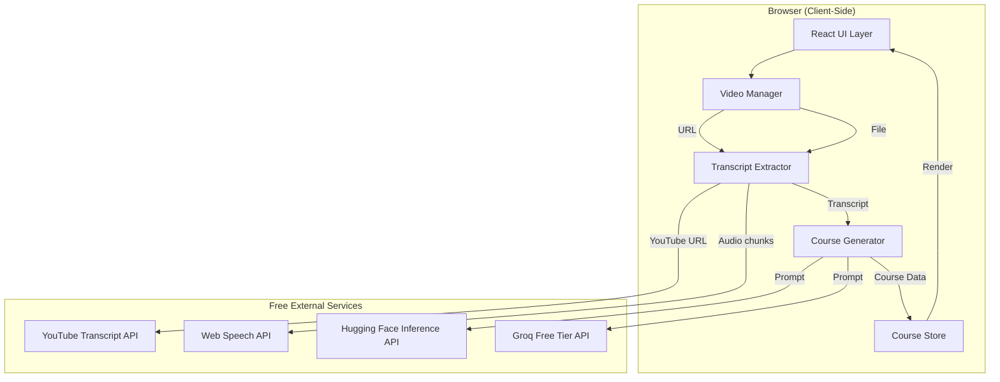
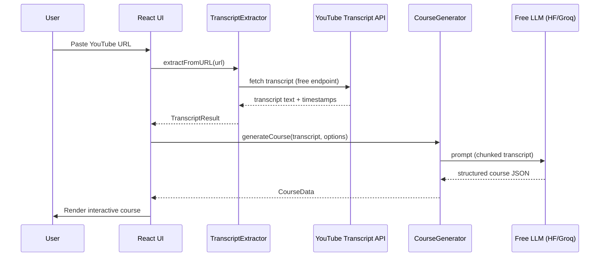
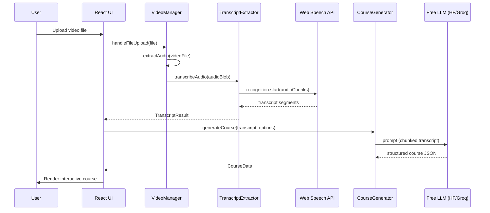

# Design Document: Video-to-Course (Clip2Course Core)

## Overview

Clip2Course transforms video content into interactive learning courses entirely for free. The system accepts video files (uploaded) or URLs (YouTube, etc.), extracts transcripts and key information, then uses open-source AI models to generate quizzes, puzzles, flashcards, and other interactive elements — all without paid APIs or backend infrastructure.

The architecture is browser-first: video processing, transcript extraction, and course generation happen client-side using Web APIs and free-tier services. For YouTube URLs, we use free transcript APIs. For uploaded videos, we use browser-based speech recognition (Web Speech API) or free-tier Whisper endpoints. Content generation leverages free-tier LLM APIs (Hugging Face Inference API, Groq free tier) to produce structured course material from transcripts.

This integrates directly into the existing React + TypeScript + Vite + Tailwind CSS 4 frontend as new routes/pages, keeping the landing page intact while adding the core application functionality.

## Architecture



## Sequence Diagrams

### Flow 1: YouTube URL Processing



### Flow 2: Video File Upload Processing



## Components and Interfaces

### Component 1: VideoManager

**Purpose**: Handles video input — accepts file uploads or URLs, validates input, and extracts audio for transcription.

```typescript
interface VideoInput {
  type: 'file' | 'url'
  file?: File
  url?: string
}

interface VideoMetadata {
  title: string
  duration: number // seconds
  source: 'youtube' | 'upload' | 'direct-url'
  thumbnailUrl?: string
}

interface VideoManager {
  validateInput(input: VideoInput): ValidationResult
  extractAudio(file: File): Promise<AudioBlob>
  getMetadata(input: VideoInput): Promise<VideoMetadata>
}
```

**Responsibilities**:
- Validate video file types (mp4, webm, ogg, mov) and size limits
- Validate URL formats (YouTube, Vimeo, direct video links)
- Extract audio track from uploaded video files using Web Audio API
- Retrieve video metadata (title, duration, thumbnail)

### Component 2: TranscriptExtractor

**Purpose**: Extracts text transcripts from video content using free methods — YouTube's built-in captions or browser-based speech recognition.

```typescript
interface TranscriptSegment {
  text: string
  startTime: number // seconds
  endTime: number
}

interface TranscriptResult {
  segments: TranscriptSegment[]
  fullText: string
  language: string
  confidence: number // 0-1
}

interface TranscriptExtractor {
  extractFromYouTube(videoId: string): Promise<TranscriptResult>
  extractFromAudio(audio: AudioBlob): Promise<TranscriptResult>
  extractFromFile(file: File): Promise<TranscriptResult>
}
```

**Responsibilities**:
- Fetch YouTube captions via free transcript endpoints
- Use Web Speech API (SpeechRecognition) for browser-based transcription
- Chunk long audio for reliable speech recognition
- Merge and clean transcript segments

### Component 3: CourseGenerator

**Purpose**: Takes a transcript and generates structured interactive course content using free-tier LLM APIs.

```typescript
interface QuizQuestion {
  id: string
  type: 'multiple-choice' | 'true-false' | 'fill-blank'
  question: string
  options?: string[]
  correctAnswer: string
  explanation: string
  sourceTimestamp: number // links back to video
}

interface Flashcard {
  id: string
  front: string
  back: string
  sourceTimestamp: number
}

interface Puzzle {
  id: string
  type: 'matching' | 'ordering' | 'word-scramble'
  instruction: string
  items: PuzzleItem[]
  solution: string[]
  sourceTimestamp: number
}

interface CourseSection {
  id: string
  title: string
  summary: string
  startTime: number
  endTime: number
  quizzes: QuizQuestion[]
  flashcards: Flashcard[]
  puzzles: Puzzle[]
}

interface CourseData {
  id: string
  title: string
  description: string
  videoMetadata: VideoMetadata
  sections: CourseSection[]
  totalQuestions: number
  estimatedTime: number // minutes
  createdAt: Date
}

interface CourseGeneratorOptions {
  difficulty: 'beginner' | 'intermediate' | 'advanced'
  interactiveTypes: ('quiz' | 'flashcard' | 'puzzle')[]
  questionsPerSection: number
  language: string
}

interface CourseGenerator {
  generateCourse(
    transcript: TranscriptResult,
    options: CourseGeneratorOptions
  ): Promise<CourseData>
  generateSection(
    segment: TranscriptSegment[],
    options: CourseGeneratorOptions
  ): Promise<CourseSection>
}
```

**Responsibilities**:
- Split transcript into logical sections (by topic/timestamp gaps)
- Craft prompts for free LLM APIs to generate course content
- Parse LLM responses into structured CourseData
- Fallback between LLM providers (Hugging Face → Groq → local generation)
- Rate-limit requests to stay within free-tier quotas

### Component 4: CourseStore

**Purpose**: Persists generated courses in browser storage (IndexedDB) so users can revisit courses without regeneration.

```typescript
interface CourseStore {
  saveCourse(course: CourseData): Promise<void>
  getCourse(id: string): Promise<CourseData | null>
  listCourses(): Promise<CourseSummary[]>
  deleteCourse(id: string): Promise<void>
  updateProgress(courseId: string, progress: CourseProgress): Promise<void>
}

interface CourseProgress {
  courseId: string
  completedSections: string[]
  quizScores: Record<string, number>
  lastAccessedAt: Date
}

interface CourseSummary {
  id: string
  title: string
  description: string
  totalSections: number
  completedSections: number
  createdAt: Date
  lastAccessedAt: Date
}
```

**Responsibilities**:
- Store courses in IndexedDB for persistence across sessions
- Track user progress (quiz scores, completed sections)
- Manage storage limits (warn user, allow cleanup)
- Export/import courses as JSON for portability

### Component 5: LLMProvider

**Purpose**: Abstracts free-tier LLM API access with automatic fallback and rate limiting.

```typescript
interface LLMProvider {
  name: string
  isAvailable(): Promise<boolean>
  complete(prompt: string, options?: LLMOptions): Promise<string>
  getRemainingQuota(): Promise<QuotaInfo>
}

interface LLMOptions {
  maxTokens: number
  temperature: number
  systemPrompt?: string
}

interface QuotaInfo {
  remainingCalls: number
  resetTime: Date
}

interface LLMProviderChain {
  providers: LLMProvider[]
  complete(prompt: string, options?: LLMOptions): Promise<string>
}
```

**Responsibilities**:
- Manage Hugging Face Inference API (free tier: ~30k tokens/day)
- Manage Groq API (free tier: 14,400 requests/day, 6k tokens/min)
- Implement fallback chain: primary → secondary → local heuristic
- Track rate limits and retry with exponential backoff
- Cache responses to minimize API calls

## Data Models

### Model 1: VideoInput

```typescript
type VideoSource = 'youtube' | 'vimeo' | 'direct-url' | 'upload'

interface VideoInput {
  type: 'file' | 'url'
  file?: File          // present when type === 'file'
  url?: string         // present when type === 'url'
  source: VideoSource  // detected from input
}
```

**Validation Rules**:
- If `type === 'file'`: file must be present, MIME type in ['video/mp4', 'video/webm', 'video/ogg', 'video/quicktime'], size ≤ 500MB
- If `type === 'url'`: url must be present, must match YouTube/Vimeo URL pattern or end in video extension
- Exactly one of `file` or `url` must be provided

### Model 2: CourseData (Primary Output)

```typescript
interface CourseData {
  id: string                    // crypto.randomUUID()
  title: string                 // generated from video title/content
  description: string           // 1-2 sentence summary
  videoMetadata: VideoMetadata
  sections: CourseSection[]     // 3-10 sections per course
  totalQuestions: number        // computed from sections
  estimatedTime: number         // minutes to complete
  createdAt: Date
}
```

**Validation Rules**:
- `sections` must have at least 1 entry
- Each section must have at least 1 interactive element (quiz, flashcard, or puzzle)
- `totalQuestions` must equal sum of all questions across sections
- `estimatedTime` computed as: (totalQuestions * 1.5) + (sections.length * 2) minutes

### Model 3: PuzzleItem

```typescript
interface PuzzleItem {
  id: string
  content: string
  position?: number      // for ordering puzzles
  matchTarget?: string   // for matching puzzles
  scrambled?: string     // for word-scramble puzzles
}
```

**Validation Rules**:
- `position` required when parent puzzle type is 'ordering'
- `matchTarget` required when parent puzzle type is 'matching'
- `scrambled` required when parent puzzle type is 'word-scramble'

## Algorithmic Pseudocode

### Main Processing Algorithm

```typescript
async function processVideoToCourse(
  input: VideoInput,
  options: CourseGeneratorOptions
): Promise<CourseData> {
  // Step 1: Validate input
  const validation = validateInput(input)
  if (!validation.isValid) {
    throw new ValidationError(validation.errors)
  }

  // Step 2: Get video metadata
  const metadata = await getVideoMetadata(input)

  // Step 3: Extract transcript
  let transcript: TranscriptResult
  if (input.type === 'url' && input.source === 'youtube') {
    transcript = await extractYouTubeTranscript(input.url!)
  } else {
    const audio = await extractAudioFromVideo(input.file!)
    transcript = await transcribeWithWebSpeech(audio)
  }

  // Step 4: Split transcript into sections
  const sections = splitIntoSections(transcript.segments)

  // Step 5: Generate course content for each section
  const courseSections: CourseSection[] = []
  for (const section of sections) {
    const courseSection = await generateSectionContent(section, options)
    courseSections.push(courseSection)
  }

  // Step 6: Assemble final course
  const course: CourseData = {
    id: crypto.randomUUID(),
    title: metadata.title,
    description: generateDescription(transcript.fullText),
    videoMetadata: metadata,
    sections: courseSections,
    totalQuestions: countTotalQuestions(courseSections),
    estimatedTime: calculateEstimatedTime(courseSections),
    createdAt: new Date()
  }

  // Step 7: Persist to IndexedDB
  await courseStore.saveCourse(course)

  return course
}
```

**Preconditions:**
- `input` is a valid VideoInput (file or URL provided)
- `options` has at least one interactive type selected
- Browser supports Web Speech API (for file uploads)
- At least one LLM provider is available

**Postconditions:**
- Returns a complete CourseData with ≥1 section
- Each section contains ≥1 interactive element
- Course is persisted to IndexedDB
- No paid API calls were made

**Loop Invariants:**
- For section generation loop: all previously generated sections are valid CourseSection objects
- Total LLM API calls stay within free-tier rate limits

### YouTube Transcript Extraction Algorithm

```typescript
async function extractYouTubeTranscript(url: string): Promise<TranscriptResult> {
  // Extract video ID from various YouTube URL formats
  const videoId = parseYouTubeVideoId(url)
  if (!videoId) {
    throw new Error('Invalid YouTube URL')
  }

  // Try multiple free transcript sources in order
  const sources = [
    () => fetchFromYouTubeTranscriptAPI(videoId),   // npm: youtube-transcript
    () => fetchFromInvidiousAPI(videoId),            // free Invidious instances
    () => fetchFromCobaltAPI(videoId),               // cobalt.tools API
  ]

  for (const fetchFn of sources) {
    try {
      const segments = await fetchFn()
      if (segments.length > 0) {
        return {
          segments,
          fullText: segments.map(s => s.text).join(' '),
          language: detectLanguage(segments[0].text),
          confidence: 0.95 // captions are high-confidence
        }
      }
    } catch (error) {
      continue // try next source
    }
  }

  throw new Error('Could not extract transcript. Video may not have captions.')
}

function parseYouTubeVideoId(url: string): string | null {
  const patterns = [
    /(?:youtube\.com\/watch\?v=)([a-zA-Z0-9_-]{11})/,
    /(?:youtu\.be\/)([a-zA-Z0-9_-]{11})/,
    /(?:youtube\.com\/embed\/)([a-zA-Z0-9_-]{11})/,
    /(?:youtube\.com\/shorts\/)([a-zA-Z0-9_-]{11})/,
  ]
  for (const pattern of patterns) {
    const match = url.match(pattern)
    if (match) return match[1]
  }
  return null
}
```

**Preconditions:**
- `url` is a non-empty string
- Network access is available
- At least one transcript source is reachable

**Postconditions:**
- Returns TranscriptResult with non-empty segments if successful
- Throws descriptive error if all sources fail
- No mutations to input parameters

**Loop Invariants:**
- Each attempted source either succeeds (returning segments) or fails cleanly
- Failed sources do not affect subsequent attempts

### Browser-Based Audio Transcription Algorithm

```typescript
async function transcribeWithWebSpeech(
  audio: Blob
): Promise<TranscriptResult> {
  const segments: TranscriptSegment[] = []
  const audioContext = new AudioContext()
  const audioBuffer = await audioContext.decodeAudioData(
    await audio.arrayBuffer()
  )

  // Chunk audio into 30-second segments for reliable recognition
  const CHUNK_DURATION = 30 // seconds
  const totalDuration = audioBuffer.duration
  const chunks = Math.ceil(totalDuration / CHUNK_DURATION)

  for (let i = 0; i < chunks; i++) {
    const startTime = i * CHUNK_DURATION
    const endTime = Math.min((i + 1) * CHUNK_DURATION, totalDuration)
    const chunkBlob = sliceAudioBuffer(audioBuffer, startTime, endTime)

    const text = await recognizeChunk(chunkBlob)
    if (text.trim()) {
      segments.push({ text: text.trim(), startTime, endTime })
    }
  }

  return {
    segments,
    fullText: segments.map(s => s.text).join(' '),
    language: 'en', // Web Speech API auto-detects
    confidence: 0.7 // browser recognition is less accurate
  }
}

function recognizeChunk(audioBlob: Blob): Promise<string> {
  return new Promise((resolve, reject) => {
    const recognition = new webkitSpeechRecognition()
    recognition.continuous = true
    recognition.interimResults = false
    recognition.lang = 'en-US'

    let result = ''
    recognition.onresult = (event) => {
      for (let i = 0; i < event.results.length; i++) {
        result += event.results[i][0].transcript + ' '
      }
    }
    recognition.onend = () => resolve(result)
    recognition.onerror = (e) => reject(e)

    // Play audio through AudioContext to feed SpeechRecognition
    playAudioForRecognition(audioBlob, recognition)
  })
}
```

**Preconditions:**
- Browser supports Web Speech API (webkitSpeechRecognition)
- Audio blob is a valid audio format decodable by AudioContext
- Microphone permission not required (using audio playback method)

**Postconditions:**
- Returns TranscriptResult (may have empty segments if audio is unclear)
- Segments are ordered chronologically with correct timestamps
- confidence reflects browser-based accuracy (~0.7)

**Loop Invariants:**
- All processed chunks have startTime < endTime
- Segments array is chronologically ordered
- Each chunk is processed independently (failure of one doesn't affect others)

### Course Content Generation Algorithm

```typescript
async function generateSectionContent(
  sectionSegments: TranscriptSegment[],
  options: CourseGeneratorOptions
): Promise<CourseSection> {
  const sectionText = sectionSegments.map(s => s.text).join(' ')
  const startTime = sectionSegments[0].startTime
  const endTime = sectionSegments[sectionSegments.length - 1].endTime

  // Build prompt for LLM
  const prompt = buildCoursePrompt(sectionText, options)

  // Call LLM with fallback chain
  const llmChain = new LLMProviderChain([
    new HuggingFaceProvider(import.meta.env.VITE_HF_API_KEY),
    new GroqProvider(import.meta.env.VITE_GROQ_API_KEY),
  ])

  const response = await llmChain.complete(prompt, {
    maxTokens: 2000,
    temperature: 0.7,
    systemPrompt: COURSE_GENERATION_SYSTEM_PROMPT
  })

  // Parse structured JSON from LLM response
  const parsed = parseLLMResponse(response)

  return {
    id: crypto.randomUUID(),
    title: parsed.title || generateSectionTitle(sectionText),
    summary: parsed.summary,
    startTime,
    endTime,
    quizzes: parsed.quizzes || [],
    flashcards: parsed.flashcards || [],
    puzzles: parsed.puzzles || []
  }
}

function buildCoursePrompt(
  text: string,
  options: CourseGeneratorOptions
): string {
  return `
Based on the following educational content, generate interactive learning materials.

Content: "${text.slice(0, 3000)}"

Generate a JSON object with:
- "title": A short section title (max 60 chars)
- "summary": 2-3 sentence summary of key concepts
- "quizzes": Array of ${options.questionsPerSection} quiz questions with:
  - "type": "multiple-choice" | "true-false" | "fill-blank"
  - "question": The question text
  - "options": Array of 4 choices (for multiple-choice)
  - "correctAnswer": The correct answer
  - "explanation": Why this answer is correct
- "flashcards": Array of 3-5 flashcards with "front" and "back"
- "puzzles": Array of 1-2 puzzles with:
  - "type": "matching" | "ordering" | "word-scramble"
  - "instruction": What to do
  - "items": Array of items
  - "solution": Correct order/matches

Difficulty level: ${options.difficulty}
Respond with ONLY valid JSON, no markdown.`
}
```

**Preconditions:**
- `sectionSegments` has at least one segment with non-empty text
- At least one LLM provider is available and within quota
- `options.questionsPerSection` > 0

**Postconditions:**
- Returns CourseSection with valid id, title, summary, and timestamps
- Contains at least one type of interactive element
- All quiz questions have correct answer and explanation
- startTime < endTime

**Loop Invariants:** N/A (single execution per section)

### LLM Provider Fallback Chain Algorithm

```typescript
class LLMProviderChain {
  private providers: LLMProvider[]
  private responseCache = new Map<string, string>()

  constructor(providers: LLMProvider[]) {
    this.providers = providers
  }

  async complete(prompt: string, options?: LLMOptions): Promise<string> {
    // Check cache first
    const cacheKey = this.hashPrompt(prompt)
    if (this.responseCache.has(cacheKey)) {
      return this.responseCache.get(cacheKey)!
    }

    // Try each provider in order
    for (const provider of this.providers) {
      try {
        const available = await provider.isAvailable()
        if (!available) continue

        const quota = await provider.getRemainingQuota()
        if (quota.remainingCalls <= 0) continue

        const response = await provider.complete(prompt, options)
        
        // Cache successful response
        this.responseCache.set(cacheKey, response)
        return response
      } catch (error) {
        // Log and continue to next provider
        console.warn(`Provider ${provider.name} failed:`, error)
        continue
      }
    }

    // All providers failed — use local heuristic generation
    return this.fallbackLocalGeneration(prompt)
  }

  private fallbackLocalGeneration(prompt: string): string {
    // Basic rule-based quiz generation when all LLMs are unavailable
    // Extract key sentences and create simple questions
    return JSON.stringify({
      title: "Section Review",
      summary: "Review the key concepts from this section.",
      quizzes: extractBasicQuestions(prompt),
      flashcards: extractBasicFlashcards(prompt),
      puzzles: []
    })
  }

  private hashPrompt(prompt: string): string {
    // Simple hash for cache key
    let hash = 0
    for (let i = 0; i < prompt.length; i++) {
      hash = ((hash << 5) - hash) + prompt.charCodeAt(i)
      hash |= 0
    }
    return hash.toString(36)
  }
}
```

**Preconditions:**
- `providers` array is non-empty
- Each provider implements the LLMProvider interface
- `prompt` is non-empty string

**Postconditions:**
- Always returns a string (never throws unless prompt is empty)
- Uses cached response if available (deterministic for same prompt)
- Falls back to local generation if all providers fail
- No paid API calls — only free-tier endpoints

**Loop Invariants:**
- Each provider attempt is independent
- Cache is checked before any network calls
- Failed providers don't corrupt state for subsequent providers

## Key Functions with Formal Specifications

### Function: splitIntoSections()

```typescript
function splitIntoSections(
  segments: TranscriptSegment[]
): TranscriptSegment[][] {
  const sections: TranscriptSegment[][] = []
  let currentSection: TranscriptSegment[] = []
  const TARGET_SECTION_DURATION = 180 // 3 minutes per section

  for (const segment of segments) {
    currentSection.push(segment)
    
    const sectionDuration = 
      segment.endTime - currentSection[0].startTime

    if (sectionDuration >= TARGET_SECTION_DURATION) {
      sections.push([...currentSection])
      currentSection = []
    }
  }

  // Don't lose remaining segments
  if (currentSection.length > 0) {
    if (sections.length > 0 && currentSection.length < 3) {
      // Merge tiny remainder into last section
      sections[sections.length - 1].push(...currentSection)
    } else {
      sections.push(currentSection)
    }
  }

  return sections
}
```

**Preconditions:**
- `segments` is a non-empty array ordered by startTime
- Each segment has startTime < endTime
- Segments don't overlap

**Postconditions:**
- Returns array of section arrays, each containing ≥1 segment
- All input segments appear in exactly one output section
- Each section is approximately TARGET_SECTION_DURATION seconds
- Sections are chronologically ordered

**Loop Invariants:**
- `currentSection` contains consecutive segments from current position
- All segments in `sections` are finalized (won't be modified)
- No segment is duplicated or lost

### Function: validateInput()

```typescript
function validateInput(input: VideoInput): ValidationResult {
  const errors: string[] = []

  if (input.type === 'file') {
    if (!input.file) {
      errors.push('No file provided')
    } else {
      const validTypes = [
        'video/mp4', 'video/webm', 'video/ogg', 'video/quicktime'
      ]
      if (!validTypes.includes(input.file.type)) {
        errors.push(`Unsupported file type: ${input.file.type}`)
      }
      if (input.file.size > 500 * 1024 * 1024) {
        errors.push('File size exceeds 500MB limit')
      }
    }
  } else if (input.type === 'url') {
    if (!input.url) {
      errors.push('No URL provided')
    } else {
      const isYouTube = /youtube\.com|youtu\.be/.test(input.url)
      const isVimeo = /vimeo\.com/.test(input.url)
      const isDirectVideo = /\.(mp4|webm|ogg)(\?.*)?$/.test(input.url)
      if (!isYouTube && !isVimeo && !isDirectVideo) {
        errors.push('URL must be YouTube, Vimeo, or direct video link')
      }
    }
  } else {
    errors.push('Input type must be "file" or "url"')
  }

  return { isValid: errors.length === 0, errors }
}
```

**Preconditions:**
- `input` is defined (not null/undefined)

**Postconditions:**
- Returns ValidationResult with boolean `isValid` and string[] `errors`
- `isValid === true` if and only if `errors.length === 0`
- No side effects on input parameter
- All error messages are human-readable

## Example Usage

```typescript
// Example 1: YouTube URL flow
import { processVideoToCourse } from './services/courseProcessor'

const course = await processVideoToCourse(
  { type: 'url', url: 'https://youtube.com/watch?v=dQw4w9WgXcQ', source: 'youtube' },
  { difficulty: 'intermediate', interactiveTypes: ['quiz', 'flashcard'], questionsPerSection: 3, language: 'en' }
)
console.log(course.title) // "Introduction to React Hooks"
console.log(course.sections.length) // 5
console.log(course.totalQuestions) // 15

// Example 2: File upload flow
const fileInput = document.querySelector<HTMLInputElement>('#video-upload')!
const file = fileInput.files![0]

const course = await processVideoToCourse(
  { type: 'file', file, source: 'upload' },
  { difficulty: 'beginner', interactiveTypes: ['quiz', 'flashcard', 'puzzle'], questionsPerSection: 5, language: 'en' }
)

// Example 3: React component integration
function CourseCreator() {
  const [course, setCourse] = useState<CourseData | null>(null)
  const [loading, setLoading] = useState(false)
  const [progress, setProgress] = useState(0)

  async function handleSubmit(input: VideoInput) {
    setLoading(true)
    setProgress(0)
    try {
      const result = await processVideoToCourse(input, defaultOptions)
      setCourse(result)
    } catch (error) {
      toast.error(error.message)
    } finally {
      setLoading(false)
    }
  }

  return (
    <div>
      <VideoInputForm onSubmit={handleSubmit} />
      {loading && <ProgressBar value={progress} />}
      {course && <CourseViewer course={course} />}
    </div>
  )
}

// Example 4: Taking a quiz
function QuizComponent({ question }: { question: QuizQuestion }) {
  const [selected, setSelected] = useState<string | null>(null)
  const [showResult, setShowResult] = useState(false)

  function handleAnswer(answer: string) {
    setSelected(answer)
    setShowResult(true)
  }

  return (
    <div>
      <h3>{question.question}</h3>
      {question.options?.map(opt => (
        <button key={opt} onClick={() => handleAnswer(opt)}
          className={showResult ? (opt === question.correctAnswer ? 'correct' : 'wrong') : ''}
        >
          {opt}
        </button>
      ))}
      {showResult && <p>{question.explanation}</p>}
    </div>
  )
}
```

## Correctness Properties

*A property is a characteristic or behavior that should hold true across all valid executions of a system — essentially, a formal statement about what the system should do. Properties serve as the bridge between human-readable specifications and machine-verifiable correctness guarantees.*

### Property 1: Input Validation Correctness

*For any* VideoInput, if the input has a valid MIME type (mp4, webm, ogg, quicktime), file size ≤ 500MB, or a URL matching YouTube/Vimeo/direct-video patterns, then validateInput SHALL return isValid === true with an empty errors array. For any input not meeting these criteria, validateInput SHALL return isValid === false with a non-empty errors array.

**Validates: Requirements 1.1, 1.2, 1.3, 1.4**

### Property 2: Course Sections Contain Interactive Content

*For any* generated CourseData, the course SHALL have at least 1 section, and every section SHALL contain at least one interactive element (quiz, flashcard, or puzzle) such that `section.quizzes.length + section.flashcards.length + section.puzzles.length ≥ 1`.

**Validates: Requirements 4.3**

### Property 3: Quiz Answers Are Valid Options

*For any* QuizQuestion of type "multiple-choice", the correctAnswer SHALL be a member of the options array.

**Validates: Requirements 4.4**

### Property 4: Section Timestamps Are Ordered

*For any* CourseSection, startTime SHALL be strictly less than endTime.

**Validates: Requirements 4.5**

### Property 5: No Data Loss in Section Splitting

*For any* array of TranscriptSegments passed to splitIntoSections, the total number of segments across all output section arrays SHALL equal the number of input segments, with no segment appearing in more than one section.

**Validates: Requirements 4.2**

### Property 6: Transcript Ordering

*For any* TranscriptResult produced by the TranscriptExtractor, the segments array SHALL be ordered by startTime in ascending order (each segment's startTime ≥ previous segment's startTime).

**Validates: Requirements 2.5, 3.4**

### Property 7: Storage Round-Trip Integrity

*For any* valid CourseData object, storing it via courseStore.saveCourse(course) and then retrieving it via courseStore.getCourse(course.id) SHALL return a deep-equal copy of the original CourseData.

**Validates: Requirements 6.1, 6.2**

### Property 8: Provider Chain Never Throws

*For any* valid prompt string, the LLMProviderChain.complete() method SHALL return a string response without throwing an exception, regardless of individual provider availability or failure states.

**Validates: Requirements 5.3, 5.4**

### Property 9: YouTube ID Format

*For any* valid YouTube URL (watch, short-link, embed, or shorts format), parseYouTubeVideoId SHALL return a string of exactly 11 characters matching the pattern [a-zA-Z0-9_-]{11}.

**Validates: Requirements 2.1**

### Property 10: Total Questions Computed Correctly

*For any* CourseData, the totalQuestions field SHALL equal the sum of `section.quizzes.length` across all sections in the course.

**Validates: Requirements 4.6**

### Property 11: Estimated Time Formula

*For any* CourseData, the estimatedTime field SHALL equal `(totalQuestions × 1.5) + (sections.length × 2)`.

**Validates: Requirements 4.7**

### Property 12: LLM Response Caching Idempotence

*For any* prompt submitted to the LLMProviderChain, calling complete() twice with the same prompt SHALL return the same response, and the second call SHALL not invoke any external provider.

**Validates: Requirements 5.5**

### Property 13: Content Type Filtering

*For any* CourseGeneratorOptions with a specific subset of interactiveTypes selected, the generated CourseData SHALL only contain interactive elements of the selected types (e.g., if only "quiz" is selected, flashcards and puzzles arrays SHALL be empty).

**Validates: Requirements 7.2, 7.4**

### Property 14: HTML Sanitization

*For any* string containing HTML special characters (<, >, &, ", '), the output sanitization function SHALL escape all such characters so that no raw HTML is rendered in the UI.

**Validates: Requirements 10.1, 10.2**

### Property 15: Malformed LLM Response Resilience

*For any* malformed JSON string returned by an LLM provider, the CourseGenerator SHALL produce a valid CourseSection (via local fallback) without throwing an exception.

**Validates: Requirements 9.3**

### Property 16: Audio Chunking Correctness

*For any* audio of duration D seconds, splitting into 30-second chunks SHALL produce exactly `Math.ceil(D / 30)` chunks, where each chunk covers a non-overlapping segment and the union of all chunks covers the full duration [0, D].

**Validates: Requirements 3.2**

### Property 17: Provider Skip on Unavailability

*For any* configuration of LLMProviderChain where N providers are marked unavailable or over-quota, the chain SHALL skip those providers and only attempt providers that report availability and remaining quota.

**Validates: Requirements 5.2**

## Error Handling

### Error Scenario 1: No Transcript Available

**Condition**: YouTube video has no captions, or Web Speech API returns empty results
**Response**: Display user-friendly error: "We couldn't extract a transcript from this video. Try a video with subtitles/captions enabled."
**Recovery**: Suggest user try a different video or upload a video with clear speech

### Error Scenario 2: LLM API Rate Limited

**Condition**: All free-tier LLM providers have exhausted their daily/hourly quota
**Response**: Fall back to local heuristic-based generation (simpler quizzes, keyword-based flashcards)
**Recovery**: Display notice that course quality may be reduced; suggest trying again later for better results

### Error Scenario 3: Video File Too Large

**Condition**: Uploaded file exceeds 500MB size limit
**Response**: Immediate validation error before any processing begins
**Recovery**: Suggest trimming the video or using a YouTube URL instead

### Error Scenario 4: Browser Doesn't Support Web Speech API

**Condition**: User's browser (Firefox, some mobile browsers) lacks SpeechRecognition
**Response**: Show browser compatibility warning, suggest Chrome/Edge
**Recovery**: If URL input is used, transcript extraction still works (doesn't need Speech API)

### Error Scenario 5: Network Failure During Processing

**Condition**: Connection lost while fetching transcript or calling LLM
**Response**: Save partial progress, show retry button
**Recovery**: Resume from last successful step on retry (don't re-process completed sections)

## Testing Strategy

### Unit Testing Approach

- Test `validateInput()` with all valid/invalid input combinations
- Test `parseYouTubeVideoId()` with all URL formats
- Test `splitIntoSections()` with various segment distributions
- Test `buildCoursePrompt()` produces well-formed prompts
- Test `parseLLMResponse()` handles valid JSON, malformed JSON, and empty responses
- Mock LLM providers for deterministic testing

**Test Framework**: Vitest (already compatible with Vite setup)

### Property-Based Testing Approach

**Property Test Library**: fast-check

- **splitIntoSections**: ∀ segments[], total output segment count === input segment count
- **validateInput**: ∀ valid VideoInput, isValid === true; ∀ invalid, isValid === false with non-empty errors
- **parseYouTubeVideoId**: ∀ generated YouTube URLs, extracted ID is 11 chars matching [a-zA-Z0-9_-]
- **LLMProviderChain**: ∀ prompt, chain always returns string (never throws)
- **CourseData assembly**: ∀ generated course, totalQuestions === sum of section questions

### Integration Testing Approach

- End-to-end flow with mocked transcript API responses
- Test YouTube URL → transcript → course pipeline with fixture data
- Test file upload → audio extraction → transcript pipeline with small test videos
- Test IndexedDB persistence: save → retrieve → verify equality
- Test LLM fallback chain with simulated provider failures

## Performance Considerations

- **Audio chunking**: Process 30-second chunks to avoid Web Speech API timeouts
- **LLM prompt size**: Limit transcript per section to 3000 chars to fit free-tier token limits
- **Response caching**: Cache LLM responses in memory to avoid duplicate API calls for retries
- **IndexedDB writes**: Batch section saves rather than writing after each generation
- **Web Workers**: Consider moving audio extraction to a Web Worker to avoid UI blocking
- **Progressive rendering**: Show each section as it completes rather than waiting for full course
- **File size**: Reject files > 500MB immediately; warn at > 200MB about processing time

## Security Considerations

- **API keys**: Store Hugging Face/Groq keys in environment variables (VITE_HF_API_KEY, VITE_GROQ_API_KEY); these are exposed client-side but are free-tier keys with rate limits
- **Input sanitization**: Sanitize URLs to prevent XSS via crafted video URLs
- **LLM output sanitization**: Escape HTML in LLM-generated quiz content before rendering
- **Content-Security-Policy**: Configure CSP headers to allow only known external domains
- **CORS**: YouTube transcript APIs may require a CORS proxy — use a free one (cors-anywhere, allorigins) or serverless function
- **IndexedDB**: Data stays in user's browser; no server-side data collection
- **URL validation**: Strict regex matching prevents SSRF-like issues

## Dependencies

### Runtime Dependencies (to add)

| Package | Purpose | Cost |
|---------|---------|------|
| `youtube-transcript` | Fetch YouTube captions | Free (npm) |
| `react-router-dom` | Client-side routing for app pages | Free (npm) |
| `idb` | IndexedDB wrapper (Promise-based) | Free (npm) |
| `uuid` | Generate unique IDs (or use crypto.randomUUID) | Free (built-in) |

### Free External Services

| Service | Purpose | Free Tier Limits |
|---------|---------|-----------------|
| Hugging Face Inference API | LLM text generation | ~30k tokens/day |
| Groq Cloud API | Fast LLM inference | 14,400 req/day, 6k tokens/min |
| Web Speech API | Browser speech recognition | Unlimited (browser built-in) |
| YouTube transcript endpoints | Caption extraction | Unlimited (public data) |
| IndexedDB | Local course storage | Limited by disk (typically 50%+ of disk) |

### Development Dependencies (to add)

| Package | Purpose |
|---------|---------|
| `vitest` | Unit/integration testing |
| `fast-check` | Property-based testing |
| `msw` | Mock Service Worker for API mocking in tests |

## Integration with Existing Frontend

The existing Clip2Course project is a static landing page. The core app will be added as new routes:

```
/ → Landing page (existing, unchanged)
/app → Main application (new)
/app/create → Video input + course generation
/app/course/:id → Course viewer with interactive elements
/app/courses → My courses dashboard
```

**React Router** will be added to handle client-side routing. The landing page remains the default route; logged-in/returning users navigate to `/app`.

**File Structure Addition**:
```
src/
├── pages/
│   ├── CreateCourse.tsx      // Video input form + generation
│   ├── CourseViewer.tsx       // Interactive course display
│   └── Dashboard.tsx         // Saved courses list
├── services/
│   ├── videoManager.ts       // Video input handling
│   ├── transcriptExtractor.ts // Transcript extraction
│   ├── courseGenerator.ts    // LLM-powered generation
│   ├── courseStore.ts        // IndexedDB persistence
│   └── llmProvider.ts       // LLM API abstraction
├── components/
│   ├── ... (existing)
│   ├── VideoInputForm.tsx    // URL/file input component
│   ├── CourseSection.tsx     // Section display
│   ├── QuizCard.tsx          // Quiz interaction
│   ├── FlashcardDeck.tsx     // Flashcard interaction
│   ├── PuzzleBoard.tsx       // Puzzle interaction
│   └── ProgressBar.tsx       // Generation progress
└── types/
    └── course.ts             // All TypeScript interfaces
```
